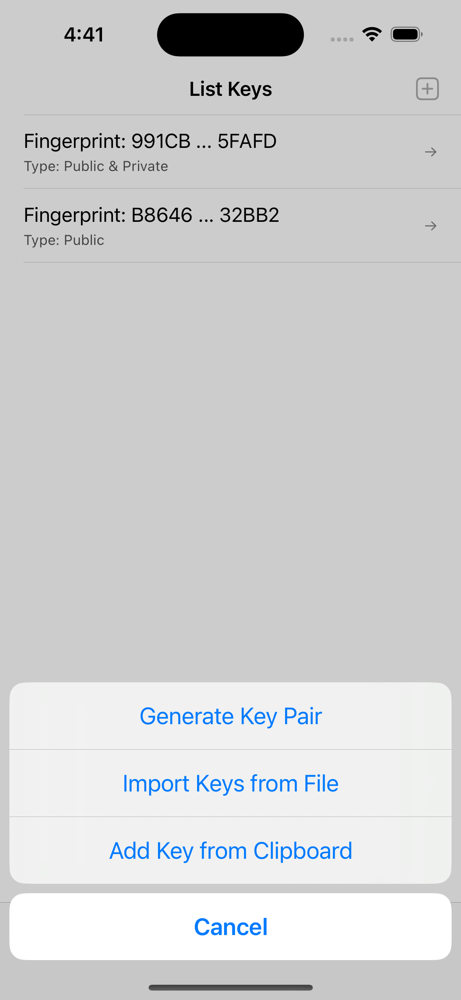
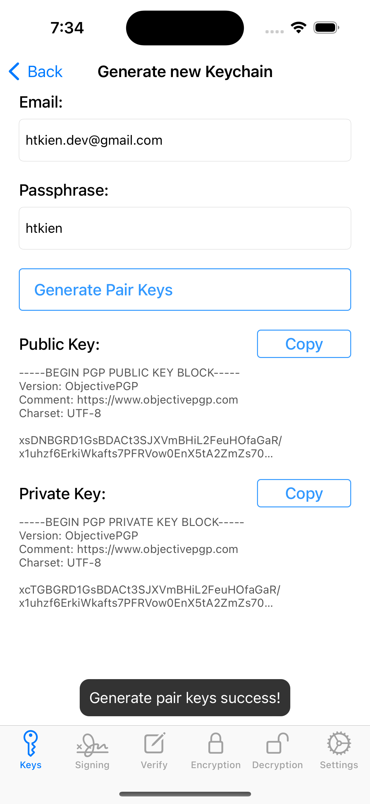
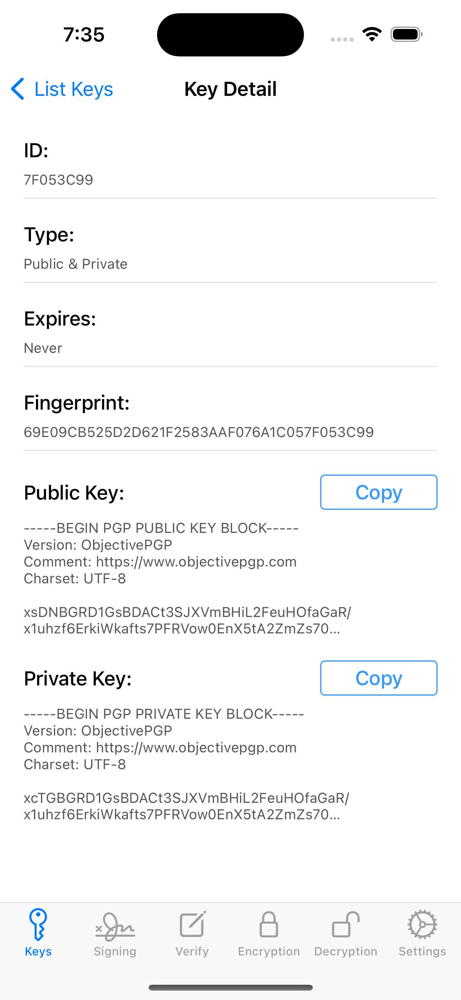
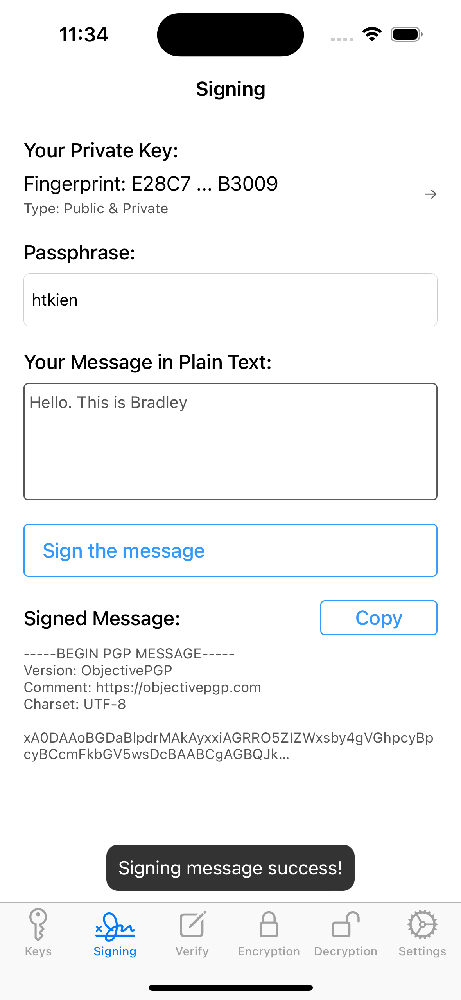
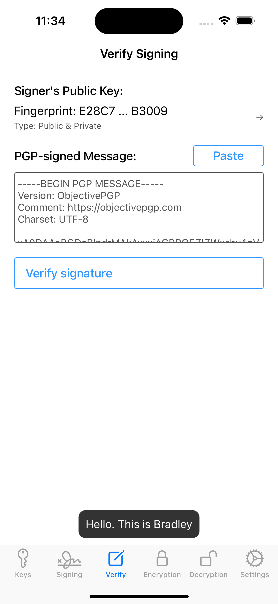

# PGP iOS Example

This is an example project demonstrating how to use PGP encryption and decryption in an iOS app. It uses the Objective-C implementation of the OpenPGP standard, OpenPGP.framework.

## Features :heart:
- Manage Keychain:
  - Generate new keys: public and private keys
  - Import key from local file url
  - Import key from clipboard
- Signing the message with private key, output with the signature
- Verify if signature was signed with one of the given keys.
- Encrypt data
- Decrypt PGP encrypted data
- Others:
  - Export keys to local files (*.gpg)

## Application
| List Keys | Generate New Key  | Key Detail  |
| ------------ | ------------ | ------------ |
|  |  |  |
| Signing | Verify Signing  |  |
|  |  |  |
| Encryption | Decryption  | Settings  |
|  |  |  |
    
## Features need to be updated in the future

- [ ] Save keys to Core Data

## Requirements

- iOS 15.0+
- Xcode 11+

## Installation

- To install the app, clone the repository and open the `PGP-example.xcworkspace` file in Xcode.

## Usage

- \<Updating\>

## Security Audit

The cryptographic library used by PGPro, [ObjectivePGP](https://objectivepgp.com/), has undergone a complete security audit from [Cure53](https://cure53.de/).

## Acknowledgment

This project uses the [ObjectivePGP](https://objectivepgp.com/) library developed by [Marcin Krzyżanowski](https://krzyzanowskim.com/).
Thereby it uses software developed by the [OpenSSL](http://www.openssl.org/) Project for use in the [OpenSSL Toolkit](https://www.openssl.org/).

## Contribution

You are welcome to contribute. Please create a [Pull Request](https://github.com/kien-hoang/PGP-example/pulls).

## Author

<a href="https://www.linkedin.com/in/kien-ht/">Hoàng Trọng Kiên (Bradley)</a>

## Reference

- https://vi.wikipedia.org/wiki/Pretty_Good_Privacy
- https://github.com/lucanaef/PGPro
- https://github.com/krzyzanowskim/ObjectivePGP
